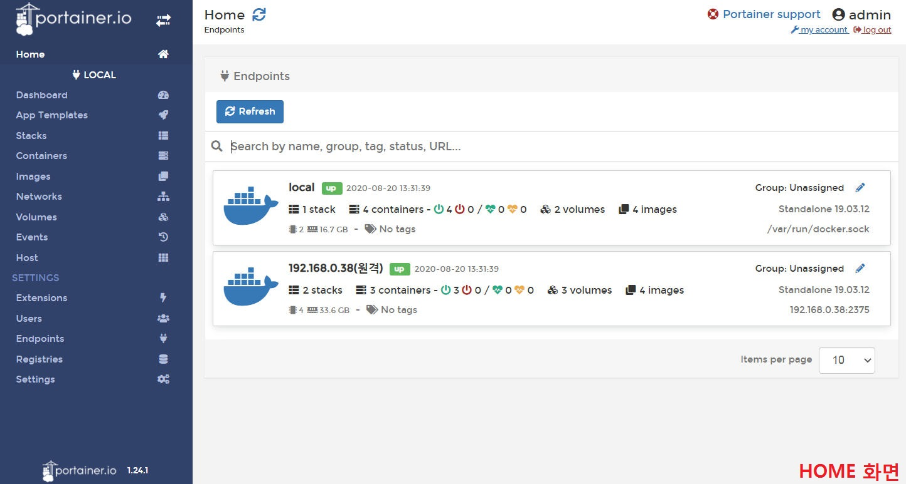
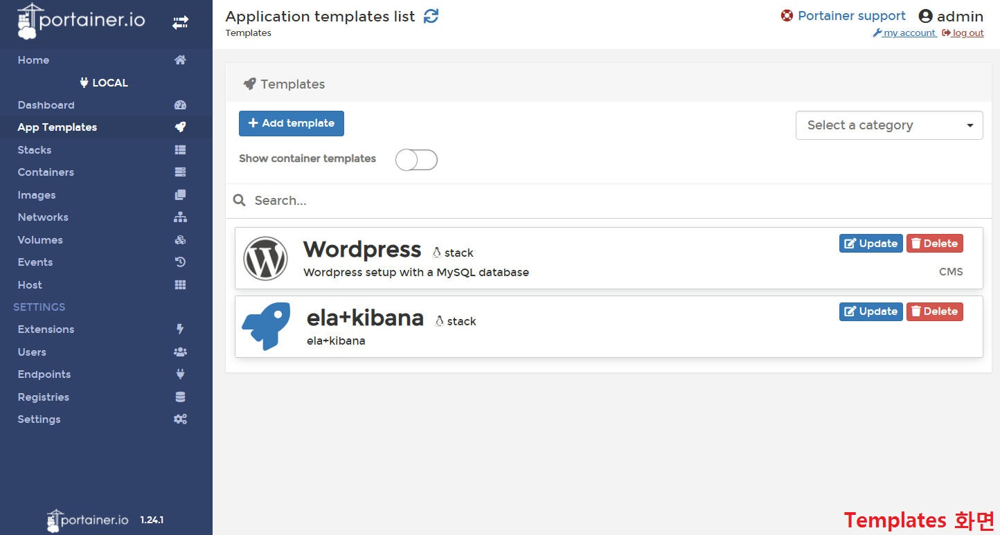
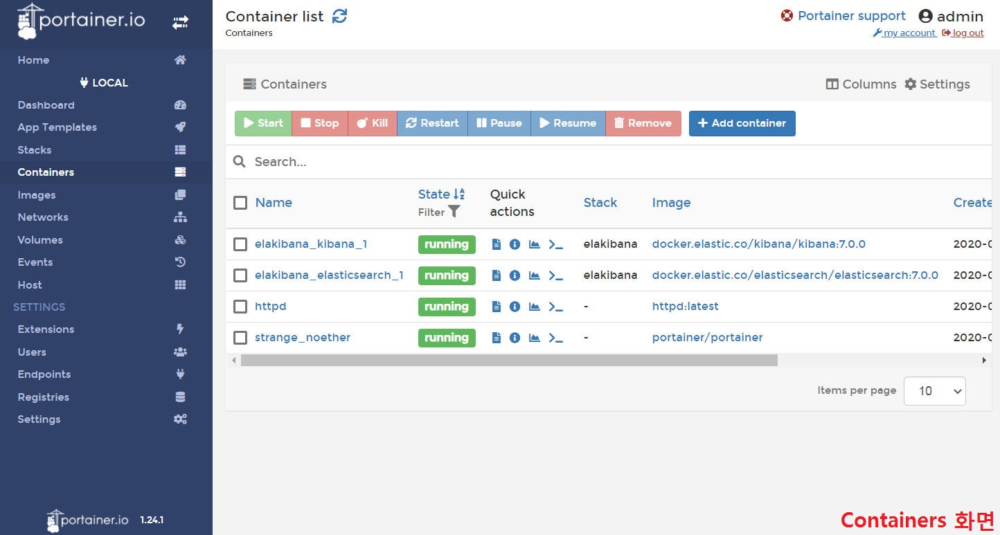
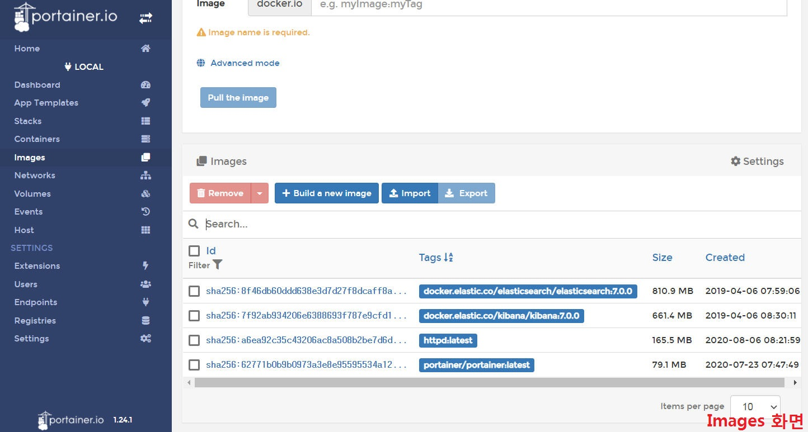
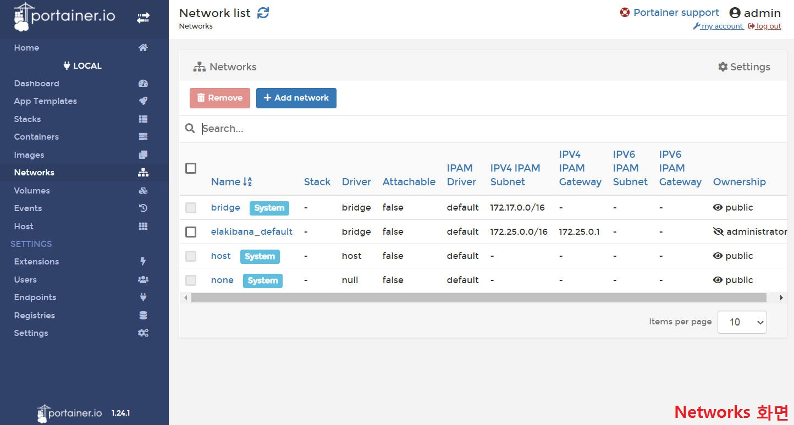
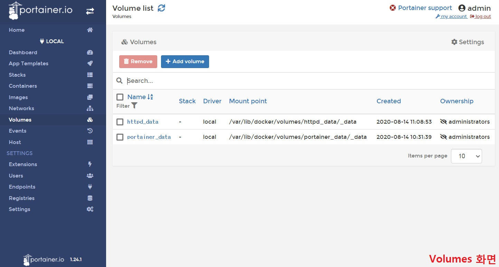

# Portainer
&nbsp;Portainer(https://www.portainer.io/) 는 다양한 Docker환경(Docker hosts, Swarm clusters 등)을 쉽게 관리 할 수 있는 웹기반 경량 관리 도구입니다.
&nbsp;Docker 엔진에서 실행되는 단일 컨테이너로 구성되며 Linux 또는 Windows 컨테이너 환경에 배포할 수 있으며 다른 플랫폼도 지원합니다. 
&nbsp;오픈소스로 배포되고 있어 무료(CE)로 사용이 가능하며, 쉘프로프트에서 Docker 명령을 일일이 수행할 필요 없이 Web UI로
손쉽게 Docker 리소스(컨테이너, 이미지, 볼륨, 네트워크 등)를 관리 할 수 있습니다.

### 주요화면 
- Home, Dashboard
  - 현재 등록되어 있는 Docker환경을 보여주는 화면으로 선택하면 선택한 Docker환경의 정보를 대시보드형태로 보여준다.
  - Docker환경은 로컬 및 원격 모두 등록가능합니다. 
  &nbsp;</img></img>
- App Templates
  - App을 쉽게 배포할 수 있도록 사전에 준비된 템플릿 제공 
    
- 리소스(컨테이너, 이미지, 네트워크, 볼륨 등)
  - 컨테이너, 이미지, 네트워크, 볼륨 등 도커 리소스에 대한 정보를 보여준다. 
  &nbsp;</img></img>
  &nbsp;</img></img>
