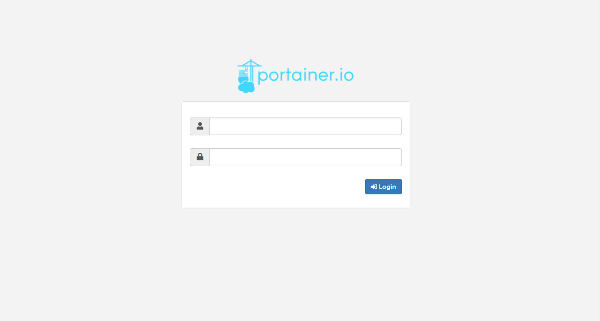
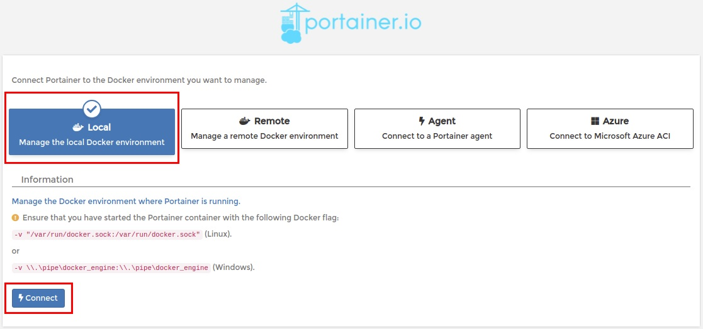

# Portainer
&nbsp;Portainer(https://www.portainer.io/) 는 다양한 Docker환경(Docker hosts, Swarm clusters 등)을 쉽게 관리 할 수 있는 웹기반 경량 관리 도구입니다.
&nbsp;Docker 엔진에서 실행되는 단일 컨테이너로 구성되며 Linux 또는 Windows 컨테이너 환경에 배포할 수 있으며 다른 플랫폼도 지원합니다.<br/>
&nbsp;오픈소스로 배포되고 있어 무료(CE)로 사용이 가능하며, 쉘프로프트에서 Docker 명령을 일일이 수행할 필요 없이 Web UI로
손쉽게 Docker 리소스(컨테이너, 이미지, 볼륨, 네트워크 등)를 관리 할 수 있습니다.

### 1. 주요화면 
- Home, Dashboard
  - 현재 등록되어 있는 Docker환경을 보여주는 화면으로 선택하면 선택한 Docker환경의 정보를 대시보드형태로 보여준다.
  - Docker환경은 로컬 및 원격 모두 등록가능합니다.(중앙집중관리)<br/>
  &nbsp;</img></img>
- App Templates
  - App을 쉽게 배포할 수 있도록 사전에 준비된 템플릿 제공<br/>
    
- 리소스(컨테이너, 이미지, 네트워크, 볼륨 등)
  - 컨테이너, 이미지, 네트워크, 볼륨 등 도커 리소스에 대한 정보를 보여준다.<br/>
  &nbsp;</img></img>
  &nbsp;</img></img>
### 2. 설치방법 
portainer CE의 기본설치방법에 대해 설명한다.
- OS : CentOS 7

1> Docker 설치
- Docker ce 설치
```bash
$ sudo yum install -y yum-utils
$ sudo yum-config-manager --add-repo https://download.docker.com/linux/centos/docker-ce.repo
$ sudo yum install -y docker-ce
```
- Docker 구동
```bash
$ sudo systemctl start docker
$ sudo systemctl enable docker
```
2> Portainer CE 설치
- portainer volume 생성
```bash
$ docker volume create portainer_data
```
- portainer 컨테이너 실행
```bash
$ docker run -d -p 8000:8000 -p 9000:9000 --name=portainer --restart=always -v /var/run/docker.sock:/var/run/docker.sock -v portainer_data:/data portainer/portainer
# 9000 포트는 관리화면에서 사용함. 8000 포트는 edge agent에서 사용하며 edge agent를 사용하지 않으면 노출 할 필요 없음 
```
3> Portainer 로그인 및 Docker 등록
- 웹브라우저를 통해 Portainer 관리화면에 접속한다. (http://서버ip:9000)<br/>
  
- Local을 선택한 후 Connect버튼을 클릭하여 로컬 Docker을 등록한다.<br/>
  

<!--### 원격 도커 등록방법
### 사용법-->
